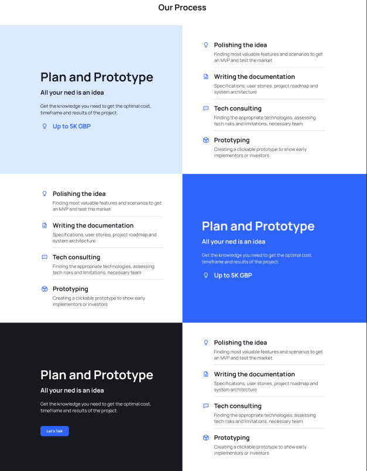

# Codex landing

This project is written on Nuxt 3. Look at the [Nuxt 3 documentation](https://nuxt.com/docs/getting-started/introduction) to learn more.

## Setup

Make sure to install the dependencies:

```bash
# npm
npm install

# pnpm
pnpm install

# yarn
yarn install

# bun
bun install
```

## Development Server

Start the development server on `http://localhost:3000`:

```bash
# npm
npm run dev

# pnpm
pnpm run dev

# yarn
yarn dev

# bun
bun run dev
```

## Production

Build the application for production:

```bash
# npm
npm run build

# pnpm
pnpm run build

# yarn
yarn build

# bun
bun run build
```

Locally preview production build:

```bash
# npm
npm run preview

# pnpm
pnpm run preview

# yarn
yarn preview

# bun
bun run preview
```

Check out the [deployment documentation](https://nuxt.com/docs/getting-started/deployment) for more information.

## Creating a new page

1. Create a new file `[name].json` (for example `healthcare.json`) in folder `content/`.

2. Add required json data (default color theme and meta tags) into this file.

```
{
  colors: {
    primary: string,
    hover: string,
    black: string,
    darkgrey: string,
    lightgrey: string,
    secondary: string,
    white: string
  },
  meta: {
    title: string,
    description: string,
    gtagConversion: string,
  }
}
```

You can add all needed JSON data for ready-to-use components here.

3. Create a new file `[name].vue` (for example `healthcare.vue`) in folder `pages/`. Please, be informed that the name of the file will be the route to this page in browser tab (`localhost:3000/healthcare`).

4. Add required vue code into this file.

```
<template>
</template>

<script setup lang="ts">
import healthcareContent from '../content/healthcare.json';

const store = useContentStore();
store.setPageContent(healthcareContent);
</script>
```

You can add all needed ready-to-use components inside `<template></template` tags.

Here you can find the example page for `localhost:3000/healthcare`.

`pages/healthcare.vue`

```
<template>
  <Welcome :data="healthcareContent.welcome" />
</template>

<script setup lang="ts">
import healthcareContent from '../content/healthcare.json';

const store = useContentStore();
store.setPageContent(healthcareContent);
</script>
```
`content/healthcare.json`

```
{
  "colors": {
    "primary": "#2BD3D4",
    "hover": "#2551C2",
    "black": "#18191F",
    "darkgrey": "#454545",
    "lightgrey": "#C0C0C0",
    "secondary": "#D3F7F9",
    "white": "#FFFFFF"
  },
  "meta": {
    "title": "Custom Software Solutions for Healthcare",
    "description": "This is Codex Software landing page"
  },
  "welcome": {
    "title": [
      "Custom software development",
      "For healthcare.",
      "For better care."
    ],
    "subtitle": "",
    "background": "healthcarewelcome-square.png",
    "button": "Request Development",
    "colors": {
      "background": "#FFFFFF",
      "title": "black",
      "subtitle": "#C0C0C0"
    }
  }
}
```


## Changing header and footer data

To change header and footer data, please use `content/default.json` file.

## Components

Learn what components can be used to build pages.

#### Ready-to-use components

These components which are free to use in page making.

- [ContactForm](#contactform)
- [ImageArticle](#imagearticle)
- [IconBoxes](#iconboxes)
- [ImageBoxes](#imageboxes)
- [SectionTitle](#sectiontitle)
- [SquaresTimeline](#squarestimeline)
- [TabbedContent](#tabbedcontent)
- [TextBoxes](#textboxes)
- [VerticalSpace](#verticalspace)
- [Welcome](#welcome)

#### Default Components

Default components are used to build layouts. It is not recommended to use them in page making but you can change their's data in `content/default.json`.

- [Footer](#footer)
- [Header](#header)

#### Service components
Service components can't be used in page making. They are used in ready-to-use components.

- [Button](#button)
- [IconBox](#iconbox)
- [ImageBox](#imagebox)
- [List](#list)
- [NavLink](#navlink)
- [Person](#person)
- [TextBox](#textbox)
- [BurgerMenu](#burgermenu)

### Footer

<b>This component uses `FooterMobile` and `FooterDesktop` components with same data for adaptivity.</b>


##### JSON data

```
{
  logo: {
    src: string,
    alt: string
  },
  description: string[],
  icons: FooterIcon[],
  nav: FooterNavItem[],
  trademark: string[]
}
```

JSON `FooterIcon`

```
{
  href: string,
  link: string,
  alt: string
}
```

JSON `FooterNavItem`

```
{
  name: string,
  subnav: FooterLink[]
}
```

JSON `FooterLink`

```
{
  name: string,
  link: string,
  external: boolean
}
```

### Header

<b>This component uses `HeaderMobile` and `HeaderDesktop` components with same data for adaptivity.</b>


##### JSON data

```
{
  logo: {
    src: string,
    alt: string
  },
  nav: FooterNavItem[],
  button: {
    text: string,
    idToScroll: string,
  },
}
```

JSON `HeaderNavItem`

```
{
  name: string,
  link?: string,
  external?: boolean,
  subnav: HeaderLink[]
}
```

JSON `HeaderLink`

```
{
  name: string,
  link: string,
  external: boolean
}
```

### ContactForm


##### JSON data

```
{
  title: string,
  id: string,
  nameInput: {
    label: string,
    placeholder: string,
    required: boolean
  },
  companyInput?: {
    label: string,
    placeholder: string,
    required: boolean
  },
  emailInput: {
    label: string,
    placeholder: string,
    required: boolean
  },
  phoneInput?: {
    label: string,
    placeholder: string,
    required: boolean
  },
  messageInput?: {
    label: string,
    placeholder: string,
    required: boolean
  },
  button: string,
  imageArticle?: {
    title: string,
    subtitle?: string,
    list?: string[],
    text?: string,
    colors?: {
      background?: string,
      subtitle?: string,
      text?: string,
      bottomText?: string
    }
  }
}
```

##### Props

prop             | description                                             | value type                    | required
---------------- | ------------------------------------------------------- | ----------------------------- | --------
type             | use all inputs or only name and email with ImageArticle | 'extended' \| 'simplified'    | yes
textAlignment    | text alignment of ImageArticle (only simplified)        | 'left' \| 'center' \| 'right' | no
articleAlignment | article alignment of ImageArticle (only simplified)     | 'left' \| 'center' \| 'right' | no
titleSize        | title size for ImageArticle (only simplified)           | 'small' \| 'large'            | no
formToLeft       | form left or right to  ImageArticle (only simplified)   | boolean                       | no

### ImageArticle


##### JSON data

```
{
  title: string,
  id?: string,
  subtitle?: string,
  list?: string[],
  button?: {
    text: string,
    idToScroll?: string,
    pageToRedirect?: string,
  },
  image?: string,
  text?: string,
  bottomText?: {
    icon?: string,
    text: string,
  },
  type?: string, // only for Tabbed content (=text)
  colors?: {
    background?: string,
    subtitle?: string,
    text?: string,
    bottomText?: string,
  },
}
```

##### Props

prop              | description                                                | value type                     | required
----------------- | ---------------------------------------------------------- | ------------------------------ | --------
buttonStyle       | filled or outline button (if button declared in JSON)      | 'fill' \| 'outline'            | no
imageToRight      | image renders in right corner (if image declared in JSON)  | boolean                        | no
component         | body is list or text                                       | 'list' \| 'text'               | yes
textAlignment     | alignment of text in article body                          | 'left' \| 'center' \| 'right'  | no
titleSize         | title size in article                                      | 'small' \| 'large'             | no

### ImageBoxes


##### JSON data

```
{
  title?: string,
  id?: string,
  imageBoxes: ImageBox[]
}
```

JSON `ImageBox`

```
{
  background: string,
  title: string,
  description?: string,
  author?: Person,
  testimonial?: string,
  tabs?: string[], // only for TabbedContent
  link?: string
}
```

JSON `Person`
```
{
  avatar: string,
  name: string,
  position: string
}
```

##### Props

prop          | description        | value type                     | required
--------------| ------------------ | ------------------------------ | --------
titlePosition | alignment of title | 'left' \| 'center' \| 'right'  | no

### IconBoxes


##### JSON data

```
{
  title?: string,
  id: string,
  iconBoxes: IconBox[]
}
```

JSON `IconBox`

```
{
  icon: string,
  alt: string,
  tabs?: string[], // only for TabbedContent
  link?: string,
  background?: string,
  title?: string,
}
```

##### Props

prop          | description                                    | value type                     | required
------------- | ---------------------------------------------- | ------------------------------ | --------
background    | icon background                                | string                         | no
titlePosition | alignment of title                             | 'left' \| 'center' \| 'right'  | no
iconToTop     | icon in top, title in bottom (only with title) | boolean                        | no

### SectionTitle


##### JSON data

No json data. It uses `<slot />` to pass the button text.

#### Props

prop     | description           | value type                     | required
---------| --------------------- | ------------------------------ | --------
id       | id of section to jump | string                         | no
position | alignment of title    | 'left' \| 'center' \| 'right'  | no

### SquaresTimeline



##### JSON data

```
{
  title?: string,
  id: string,
  items: (ImageArticle | List)[]
}
```

JSON `ImageArticle`

```
{
  title: string,
  subtitle?: string,
  list?: string[],
  button?: {
    text: string,
    idToScroll: string,
  },
  image?: string,
  text?: string,
  bottomText?: {
    icon?: string,
    text: string
  },
  type?: string, // can be only 'text'
  colors?: {
    background?: string,
    subtitle?: string,
    text?: string,
    bottomText?: string
  }
}
```

JSON `List`
```
{
  list: ListItem[],
  type: string // can be only 'list'
}
```

JSON `ListItem`

```
{
  title: string,
  text: string,
  icon?: string
}
```

#### Props

prop          | description        | value type                     | required
--------------| ------------------ | ------------------------------ | --------
titlePosition | alignment of title | 'left' \| 'center' \| 'right'  | no

### TabbedContent


##### JSON data

```
{
  title?: string,
  id: string,
  tabs: string[],
  background?: string,
  tabsContent: (ImageBox | IconBox | TextBox)[]
}
```

JSON `ImageBox`

```
{
  background: string,
  title: string,
  description?: string,
  author?: Person,
  testimonial?: string,
  tabs?: string[],
  link?: string
}
```
JSON `Person`

```
{
  avatar: string,
  name: string,
  position: string
}
```

JSON `IconBox`

```
{
  title?: string,
  icon: string,
  alt: string,
  tabs?: string[],
  link?: string,
  background?: string
}
```

JSON `TextBox`

```
{
  title: string,
  subtitle: string,
  text: string,
  icon?: string,
  tabs?: string[]
}
```

##### Props

prop            | description                                                     | value type                           | required
--------------- | --------------------------------------------------------------- | ------------------------------------ | --------
titlePosition   | alignment of title                                              | 'fill' \| 'outline'                  | no
component       | component inside TabbedContent body                             | 'TextBox' \| 'ImageBox' \| 'IconBox' | yes
iconsBackground | define background inside icon box (only if component='IconBox)' | string                               | no
iconToTop       | icon in top, title in bottom (only for icons with title)        | boolean                              | no

### TextBoxes


##### JSON data

```
{
  title?: string,
  id?: string,
  textBoxes: TextBox[]
}
```

JSON `TextBox`

```
{
  title: string,
  subtitle: string,
  text: string,
  icon?: string,
  tabs?: string[] // only for TabbedContent
}
```

##### Props

prop          | description            | value type                     | required
------------- | ---------------------- | ------------------------------ | --------
titlePosition | alignment of title     | 'fill' \| 'outline'            | no
textAlignment | alignment of body text | 'left' \| 'center' \| 'right'  | no


### VerticalSpace


##### JSON data

This component does not have JSON data.

##### Props

prop  | description      | value type | required
----- | ---------------- | -----------| --------
height | height of space | string     | yes

### Welcome


##### JSON data

```
{
  title: string[],
   button: {
    text: string,
    idToScroll: string,
  },
  background: string,
  subtitle?: string,
  colors?: {
    title?: string,
    subtitle?: string
  }
}
```

##### Props

prop        | description                              | value type | required
----------- | ---------------------------------------- | ---------- | --------
imageToLeft | image to left or right to Welcome header | boolean    | no

### Button


##### JSON data

No json data. It uses `<slot />` to pass the button text.

##### Props

prop      | description                                 | value type          | required
--------- | ------------------------------------------- | ------------------- | --------
style     | make filled or outlined the button          | 'fill' \| 'outline' | no
size      | change padding inside button 10/24 or 17/32 | 'small' \| 'large'  | no
isLoading | ref to toggle loader                        | boolean             | no

### IconBox


##### JSON data

```
{
  icon: string,
  alt: string,
  tabs?: string[], // only for TabbedContent
  link?: string,
  background?: string,
  title?: string,
}
```

##### Props

prop          | description                                    | value type                     | required
------------- | ---------------------------------------------- | ------------------------------ | --------
background    | icon background                                | string                         | no
iconToTop     | icon in top, title in bottom (only with title) | boolean                        | no


### ImageBox


##### JSON data

```
{
  background: string,
  title: string,
  description?: string,
  author?: Person,
  testimonial?: string,
  tabs?: string[],
  link?: string
}
```

##### Props

This component does not have any props.

### List


##### JSON data

```
[
  ListItem
]
```

JSON `ListItem`

```
{
  title: string,
  text: string,
  icon?: string
}
```

##### Props

This component does not have any props.

### NavLink


##### JSON data

```
{
  name: string,
  external: boolean,
  link: string
}
```

##### Props

This component does not have any props.

### Person


##### JSON data

```
{
  avatar: string,
  name: string,
  position: string
}
```

##### Props

This component does not have any props.

### TextBox


##### JSON data

```
{
  title: string,
  subtitle: string,
  text: string,
  icon?: string,
  tabs?: string[] // only for TabbedContent
}
```

#### Props

prop          | description            | value type                     | required
------------- | ---------------------- | ------------------------------ | --------
textAlignment | alignment of body text | 'left' \| 'center' \| 'right'  | no

### BurgerMenu


##### JSON data

This component does not use JSON data.

#### Props

prop             | description                                      | value type | required
---------------- | ------------------------------------------------ | ---------- | --------
isMenuOpen       | makes animation of cross icon for open menu      | boolean    | yes
toggleIsMenuOpen | action for click event to toggle icon animation  | () => void | yes